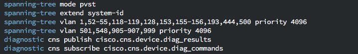
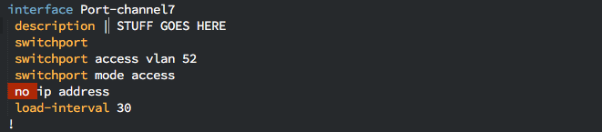
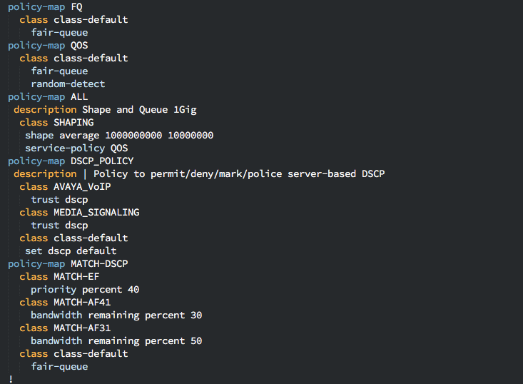
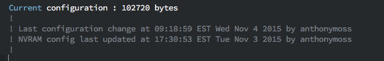

# Network Config Syntax Package for Sublime Text

This syntax highlighting package should work with any "Cisco-IOS Like" configuration files.

There's updates that need to be done to all syntax files. I also will need to work on more such as Arista (EOS) or Brocode, Dell (Force-10) and others though most of the Cisco like IOS should work fairly well.

There will also be further updates as to match <VARIABLE NAMES> such as prefix-list names and others.

### Installing

**Without Git:** Download the zip from github, and extract the files to your Sublime Text "Packages" directory, into a new directory named `Network Config Syntax`. You can find the packages directy by going to Preferences -> Browse packages, within Sublime Text.

**With Git:** Clone the repository in your Sublime Text "Packages" directory:

    git clone git://github.com/yandy-io/NetworkConfigSyntax.git

### Highlighting
Once installed navigate to View->Syntax->IOS or Junos to apply the Cisco or Junos syntax to the document.

##### CISCO
This syntax definition will automatically be applied to .ios, .cisco, .ioscfg, and .iostxt files.

##### JUNIPER
This syntax definition will automatically be applied to .junos, .jcfg, .jcfg, and .jtxt files.

### Customizing
Once <NETWORK> syntax is turned on you can then try different color schemes by going to Preferences -> Color Schemes.

If you wish to customize this even further for your own needs navigate to the Cisco package (Preferences -> Browse Packages). Edit the `<VENDOR> Definitions.json-tmlanguage` file within Sublime Text. After your changes go to Tools -> Build, to rebuild the syntax definitions.

### Usage

##### first-level keywords have 0 spaces before keyword

In the above scenario hostname and policy-map will be highlighted.

##### second-level configs have 1-2 spaces

The colors depend on theme schme used.

##### third-level configs have 3-4 spaces

Again, colors depend on theme being used.

##### Comment-block

### CREDITS

This is a Cisco modified version of the original, which is <a href="https://github.com/tunnelsup/sublime-cisco-syntax" target="_blank">here</a>, credit to tunnelsup for the amazing work.

The Junos original can be found <a href="https://github.com/nprintz/junos-sublime-pkg" target="_blank">here</a>, by nprintz.